


 

<i>Systems-oriented engineer across Python, SQL, and Linux — concurrent systems, REST APIs, and security automation, backed by 10+ years navigating Linux environments and a defensive, secure-by-design habit from security research work. Multilingual and remote-native.</i>

  

&nbsp;&nbsp;
&nbsp;&nbsp;

  


<b>Open the record</b> &nbsp;·&nbsp; <i>DataAnnotation · KW Reserve</i>

 

**Software Engineer — DataAnnotation** &nbsp;·&nbsp; *Remote Contract, 2026 — Present*

- Systematically stress-test agentic LLM coding runtimes against real-world open-source codebases, surfacing logic, instruction-following, and verification failures in production-grade code.
- Operate Linux CLI-based agent environments (tmux, git, pytest) to reproduce, capture, and log failure conditions for structured technical review — daily terminal-driven diagnostic work.
- Design targeted test scenarios spanning ambiguity categories — underspecified requirements, technical impossibilities, contextual ambiguity, and conflicting constraints — to systematically elicit and document model failures.

**Full-Stack Developer / SysAdmin — KW Reserve** &nbsp;·&nbsp; *Winter Garden, FL · Remote, Part-Time, 2022 — Present*

- Architect and maintain technical infrastructure, web architecture, and production database organization for a real estate brokerage's digital operations.
- Design and deploy automated cold-outreach systems integrating third-party APIs (Google, Groq, Gemini) to accelerate lead generation.
- Implement secure, token-based authentication and role-based access control (RBAC) across internal applications.

 


  


<table>
<tr>
<td width="50%"><a href="https://github.com/Variosity/go-concurrent-port-scanner"></a></td>
<td width="50%"><a href="https://github.com/Variosity/go-aes-server"></a></td>
</tr>
<tr>
<td width="50%"><a href="https://hacklingo.tech"></a></td>
<td width="50%"><a href="https://github.com/Variosity/-Achlys"></a></td>
</tr>
</table>

 


 

  


 

&nbsp;&nbsp;
&nbsp;&nbsp;

  

